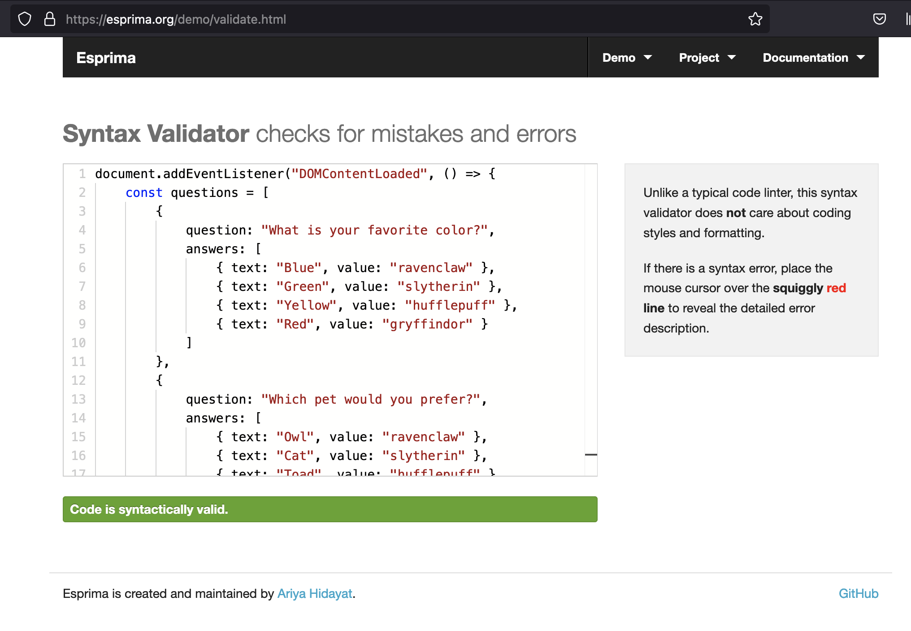

# Javascipt project - The Hogwarts quiz to find your house

## Introduction

Welcome to the Hogwarts House Quiz website! This project represents an exciting challenge in my journey to enhance my web development skills. The aim is to create an engaging and interactive platform where users can discover their Hogwarts house by taking a fun and informative quiz.

Developed using HTML, CSS, and JavaScript, this project offers an interesting user experience that captures some of the magic of the Harry Potter universe. Users will be able to take a quiz and receive a house assignment based on their answers.

In this README, I'll walk you through my journey getting to the live site. I hope you find this project both informative and enjoyable as you explore your Hogwarts house. Thank you for joining me on this magical journey!

The live link can be found here - [Link to live site](https://tbergius.github.io/project-two-thomas/)

## 1. Purpose of the project

For this project, I wanted to create an interactive and engaging quiz that would allow users to discover their Hogwarts house in a fun and magical way. Being a fan of the Harry Potter and the wizarding world, I thought it would be exciting to bring the world of Hogwarts to life through a quiz that captures the essence of the four houses. The goal was to design a platform that not only provides a memorable user experience but also pays tribute to the rich lore of the Harry Potter universe.

## 2. User stories

New Users:

- As a new user, I want to quickly understand the quiz's purpose and start the quiz.
- As a new user, I want to easily navigate through the quiz without getting confused or lost.
- As a new user, I want to feel a sense of connection to the Harry Potter world as I answer the quiz questions.
- As a new user, I want to receive a house assignment that feels accurate and personalized based on my answers.

Returning Users:

- As a returning user, I want to retake the quiz to see if my house assignment changes or remains consistent.
- As a returning user, I want to explore additional content about the houses and share my results with friends.
- As a returning user, I want to enjoy a seamless experience with the quiz, without encountering technical issues or bugs.
- As a returning user, I want to compare my results with friends and see how my personality aligns with different houses over time.

## 3. Features

- **Welcome Message:** A friendly introduction that immerses users in the world of Harry Potter, explaining the purpose of the quiz and setting the magical tone.
- **Quiz Questions:** A series of carefully crafted questions designed to assess the user's personality traits, preferences, and values, guiding them towards one of the four Hogwarts houses.
- **Progress Tracker:** A visual indicator that shows users how far they have progressed through the quiz, helping them stay engaged and informed.
- **House Sorting Result:** After completing the quiz, users receive their Hogwarts house assignment, accompanied by a detailed description of the house's characteristics and what it means to belong to that house.
- **Responsive Design:** The quiz is fully responsive, ensuring a smooth and visually appealing experience across all devices, including desktops, tablets, and smartphones.
- **Retake Option:** Provides users with the ability to retake the quiz at any time, allowing them to see if their house assignment changes with different answers.

## 4. Future Features

- **More Visual Excitement:** Have background images for the questions, that relate to the question such as pets, castles, schoolboards, etc.
- **Social Sharing:** Offers users the option to share their house assignment on social media platforms, inviting friends to take the quiz and compare results.
- **Additional Content:** Links to more information about each Hogwarts house, encouraging users to dive deeper into the lore and explore their house further.

## 5. Design

The site has a simplistic approach to ensure the quiz is easy to navigate, and the user is not distracted by other information. 

### 5.1 Color Scheme

I knew I wanted a dark page as the initial design, and I chose a gold color for the letters as this looked amazing on one of the other pages I looked at for inspiration. That page was made by Michael Bergmann and can be found here: [https://codepen.io/ice_bergmann/pen/vmjWqg](https://codepen.io/ice_bergmann/pen/vmjWqg)

### 5.2 Typography

I chose the EB Garamond font from Google Fonts as that showed as one of the top results when searching for Harry Potter fonts. And I liked what I saw!

## 6. Wireframes

Initially I made a rough sketch of what I wanted, and reasonably quick came to the realisation that I want a simple page. Not too much fluff, just the quiz. As such, I did not create any wireframes and kept the Love Maths project in mind when making the design.

## 7. Technology

- HTML - This is the foundation code the website is written in.
- CSS - The style structure used.
- [Gitpod](https://www.gitpod.io/) - I used Gitpod to write, commit, and push the code. 
- [Google Fonts](https://fonts.google.com/) - I used the fonts and links to the font from Google Fonts.
- [Amiresponsive](https://ui.dev/amiresponsive) - For creating the nice picture featured at the start.
- [w3 validator](https://validator.w3.org/) - The validator used to check the HTML and CSS.
- [Google Chrome DevTools & Lighthouse](https://developer.chrome.com/docs/lighthouse/overview) - For performance review.
- [Responsive Viewer](https://responsiveviewer.org/) - Used this to test on different devices.

## 8. Testing

Several methods of testing and fixing bugs were performed. The initial test was while coding, and fixing any problem before continuing with the next step. Once the project was finished, a code validation took place and a step-by-step interaction was performed as to how a user would use the site.

### 8.1 Code Validation

- W3C HTML validator. This validator checks the markup validity of Web documents in HTML.

- W3C CSS validator. This validator checks Cascading Style Sheets (CSS) documents with style sheets.

- Javascript validators. Two validators were used. JShint,  a tool that helps to detect errors and potential problems in the JavaScript code. And Esprima, a high performance standard-compliant ECMAScript parser written in ECMAScript (also popularly known as JavaScript).

### 8.2 Test cases

- Starting page, click start

- First question, stop quiz

- Back to starting page, start again

- Select one answer, dont continue

- Select a different answer, in case you change your mind, and continue

- Go to next step as intended 

- Finish quiz, see the results, and retake the quiz

- Back to start of the quiz

During these manual test, basics were check for selecting multiple answers, and letting the timer run out. As noted at the start, the timer is there to give a sense of urgency and not overthing the given answer, it is not there to "fail" the user. Everything was found to be in working order and useable for the end-user.

### 8.3 Bugs

As testing was done throughout the coding, no bugs were found at the end as it all worked. Some issues were found with the validation and adjusted, unfortunately this was not documented. This will be noted for future projects so I can show what was found and adjusted before continuing. 

### 8.4 Accessibility 

Several test were done to make sure the site was accessible from different browsers, and screen sizes. 

- Cross browser check: Google Chrome

- Cross browser check: Firefox

- Cross browser check: Safari

- Responsive viewer

- Lighthouse performance desktop

- Lighthouse performance mobile

- Pagespeed performance desktop

- Pagespeed performance mobile

## 9. Deployment

### 9.1 The site was deployed via GitHub pages.
To deploy using GitHub pages: 

- Login or Sign Up to GitHub
- Open the repository of the project
- Go to “Settings” on the navigation bar, it is under the repository title
- Click on “Pages” in the navigation panel on the left side
- Under “Source”, choose which branch to deploy (Main or Master)
- Choose which folder to deploy from, usually “/root”
- Click “Save”, wait for the page to be deployed
- The URL is displayed above the “Source”

The deployed site can be found here - [https://tbergius.github.io/project-two-thomas/](https://tbergius.github.io/project-two-thomas/)

### 9.2 Working in Gitpod

To load the project in github, please follow these steps:

- Login or Sign Up to Gitpod
- Click on New Workspace
- Enter the repository url created from a template, or your own url if you worked on it before in a different environment. This URL will be the Github repository URL
- Wait for it to load, and select it from the drop-down menu
- Click on continue
- Wait until the workspace loads
- Happy coding!

The repository for this project can be found here - [https://github.com/Tbergius/project-two-thomas](https://github.com/Tbergius/project-two-thomas)

## 10. Credits and note

### 10.1 Credits

- Content written by me (Thomas) with assistance from ChatGPT. ChatGPT was used for most of the contect on the site, as I preferred to spent my time on the coding. As for the coding, sometimes I used an incorrect name so the code would not work or no longer work. ChatGPT was useful to help with finding this out as I could not see what I did wrong. As I was very sure I had it correct, after all, I just did it. An alternative would be to listen better to the introduction video and take a small break.
- The questions are found from different places, and inspiration by some things found on Google. Some places I remembered to write down:
[https://codepen.io/ice_bergmann/pen/vmjWqg](https://codepen.io/ice_bergmann/pen/vmjWqg)
[https://www.teacherspayteachers.com/Product/Harry-Potter-Sorting-Hat-Quiz-for-Students-with-Answer-Key-1562805](https://www.teacherspayteachers.com/Product/Harry-Potter-Sorting-Hat-Quiz-for-Students-with-Answer-Key-1562805)
I will have to remember a next time to write down if I take inspiration, or copy, questions from somewhere.

### 10.2 Note

This is the 2nd version of the README.md file to adjust for changes required by feedback from the course. The initial readme was incomplete, and should have had a separate testing file. I decided to include the testing in the main readme this time as it worked well for my 3rd project. While I am sure I made the testing file, I think I made an error with uploading it. As I did not double check if the project was complete, this is solely my responsibility and fault. As I like to call in in daily life: this was a case of **PICNIC**: 

**P**roblem

**I**n

**C**hair

**N**ot

**I**n

**C**omputer.
