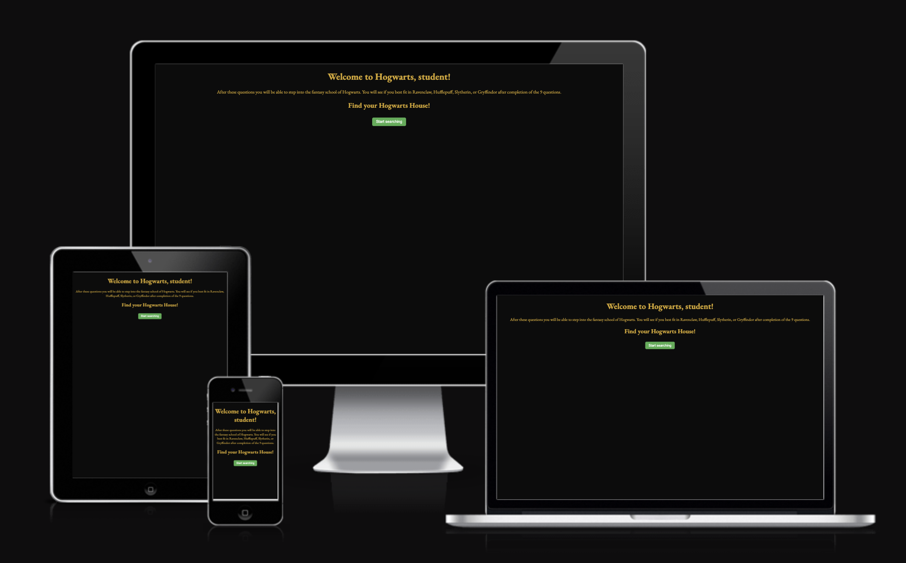

# The Hogwarts quiz to find your house

## Introduction

Welcome to the Hogwarts House Quiz website! This project represents an exciting challenge in my journey to enhance my web development skills. The aim is to create an engaging and interactive platform where users can discover their Hogwarts house by taking a fun and informative quiz.

Developed using HTML, CSS, and JavaScript, this project offers an interesting user experience that captures some of the magic of the Harry Potter universe. Users will be able to take a quiz and receive a house assignment based on their answers.

In this README, I'll walk you through my journey getting to the live site. I hope you find this project both informative and enjoyable as you explore your Hogwarts house. Thank you for joining me on this magical journey!

The live link can be found here - [https://tbergius.github.io/project-two-thomas/] (https://tbergius.github.io/project-two-thomas/)

---
## User Experience

- As a visiting user, I would like to have a fun experience to get a Hogwarts House without doing a lot of reading
- As a visiting user, I would like to not get distracted by extra information on the page
- As a visiting user, I would like to get my house assigned without going through a ton of questions
- As a returning user, I would like to see how my different answers affect my house sorting
- As a returning user, I would be happy to see that my house stays the same if I choose the same answers

---
## Planning

During the planning stage, I realized quite quick that I wanted a simple page, without to much details so the focus would be the quiz. From that perspective, I realized the planning would be fast and have a bit of the same layout feeling of the Love Mats project: the center item is where the action happens.

For the questions, I took a mix of questions so they would not be all the same. With that, I mean that they are not all school related, or what would you do if questions. I also did not like vague questions that you can see in soe of the official Harry Potter quizes such as preferences for dawn or dusk. 

---
## Features

### Pages

There is one page, the main page. As such, no menu, header, or footer is added. It is a simplistica layout, making sure the quiz stands out
The user is welcomed to the site, with a short introdction, and prompted to start the quiz.
After starting the quiz, the first question is shown and the introduction is removed. There is also a timer, that counts down from 25 seconds. This timer is added to make the user not think endlessly about the questions, and more select an answer that is first coming to mind. As this quiz is personal and is no competition, the timer simply stops at zero and nothing happens to the user or the quiz - it continues when the player resumes. This is intentional. In an earlier version, the timer was looped and started again when it reached zero. 
After the 9 questions, that are always in the same order, the user is shows the house based on the answers, with a short house explanation.
The user can restart the quiz from the final screen.

### Future features and expansions

If I would work more on this project, I would add some images at the end when the house is prompted. This might give the user more fulfillment as right now the user needs to know more what the houses stand for. 
I would also give the user the option for amount of questions, ranging from 7-25 or so.

---
## Design

The site has a simplistic aproach to ensure the quiz is easy to navigate, and the user is not distracted by other information. 

### Colour Scheme

I knew I wanted a dark page as the initial design, and I chose a gold color for the letters as this looked amazing on one of the other pages I looked at for inspiration. That page was made by Michael Bergmann and can be found here: [https://codepen.io/ice_bergmann/pen/vmjWqg] (https://codepen.io/ice_bergmann/pen/vmjWqg)

### Typography

I chose the EB Garamond font from Google Fonts as that showed as one of the top results when searching for Harry Potter fonts. And I liked what I saw!

### Favicon

The icon was found via Google image search, and modified via favicon.io

---
## Wireframes

Initially I made a rough sketch of what I wanted, and reasonably quick came to the realisation that I want a simple page. Not too much fluff, just the quiz. As such, I did not create any wireframes and kept the Love Maths project in mind making the design.

---
## Technology

- HTML - This is the foundation code the website is written in.
- CSS - The style structure used.
- [Gitpod](https://www.gitpod.io/) - I used Gitpod to write, commit, and push the code. 
- [Google Fonts](https://fonts.google.com/) - I used the fonts and links to the font from Google Fonts.
- [Amiresponsive](https://ui.dev/amiresponsive) - For creating the nice picture featured at the start.
- [w3 validator](https://validator.w3.org/) - The validator used to check the HTML and CSS.
- [Google Chrome DevTools & Lighthouse](https://developer.chrome.com/docs/lighthouse/overview) - For performance review.
- [Responsive Viewer](https://responsiveviewer.org/) - Used this to test on different devices.

---
## Testing

The testing consist of two major parts: 
- testing throughout, so any issue is spotted and solved before going on.
- testing at the end, with validators. This is added to a TESTING.md file that also includes images of results

As a final test, all the buttons were tested and clicked, and they work as intended. 

---
## Deployment

# The site was deployed via GitHub pages.
To deploy using GitHub pages: 

- Login or Sign Up to GitHub
- Open the repository of the project
- Go to “Settings” on the navigation bar, it is under the repository title
- Click on “Pages” in the navigation panel on the left side
- Under “Source”, choose which branch to deploy (Main or Master)
- Choose which folder to deploy from, usually “/root”
- Click “Save”, wait for the page to be deployed
- The URL is displayed above the “Source”

The deployed site can be found here - [https://tbergius.github.io/project-two-thomas/] (https://tbergius.github.io/project-two-thomas/)

# Working in Gitpod

To load the project in github, please follow these steps:

- Login or Sign Up to Gitpod
- Click on New Workspace
- Enter the repository url created from a template, or your own url if you worked on it before in a different environment. This URL will be the Github repository URL
- Wait for it to load, and select it from the drop-down menu
- Click on continue
- Wait until the workspace loads
- Happy coding!

The repository for this project can be found here - [https://github.com/Tbergius/project-two-thomas] (https://github.com/Tbergius/project-two-thomas)

---
## Credits
### Content
- Content written by me (Thomas) with assistance from ChatGPT. 
- The questions are found from different places, and inspiration by some things found on Google. Some places I remembered to write down:
[https://codepen.io/ice_bergmann/pen/vmjWqg](https://codepen.io/ice_bergmann/pen/vmjWqg)
[https://www.teacherspayteachers.com/Product/Harry-Potter-Sorting-Hat-Quiz-for-Students-with-Answer-Key-1562805](https://www.teacherspayteachers.com/Product/Harry-Potter-Sorting-Hat-Quiz-for-Students-with-Answer-Key-1562805)
I will have to remember a next time to write down if I take inspiration, or copy, questions from somewhere.

